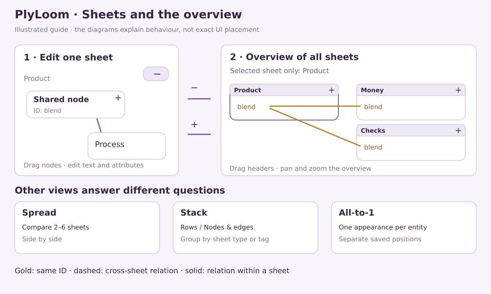
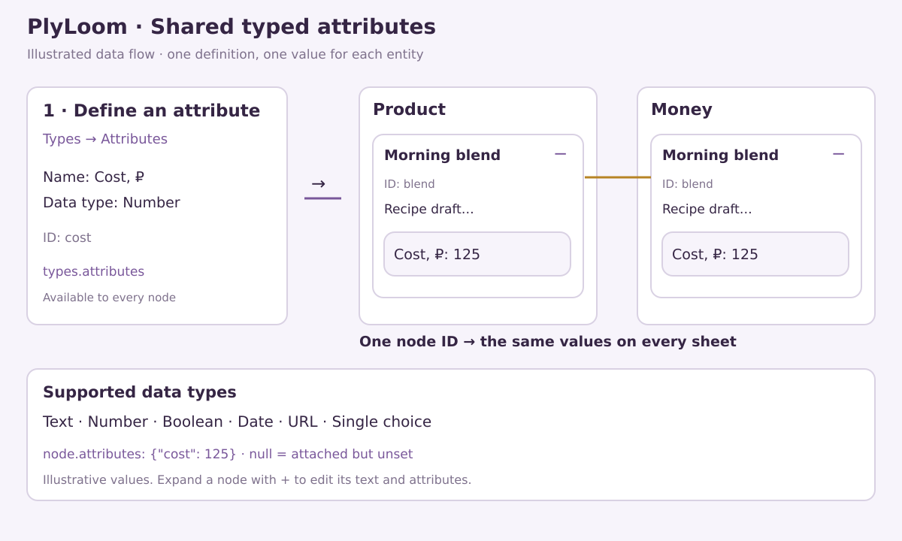
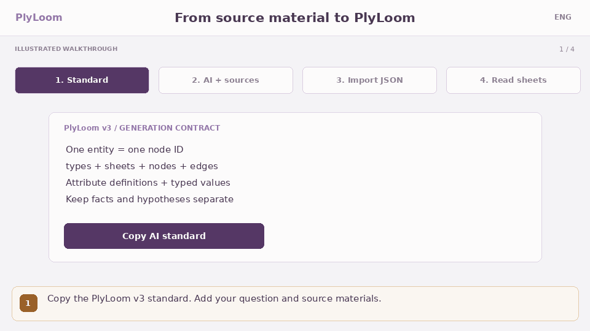
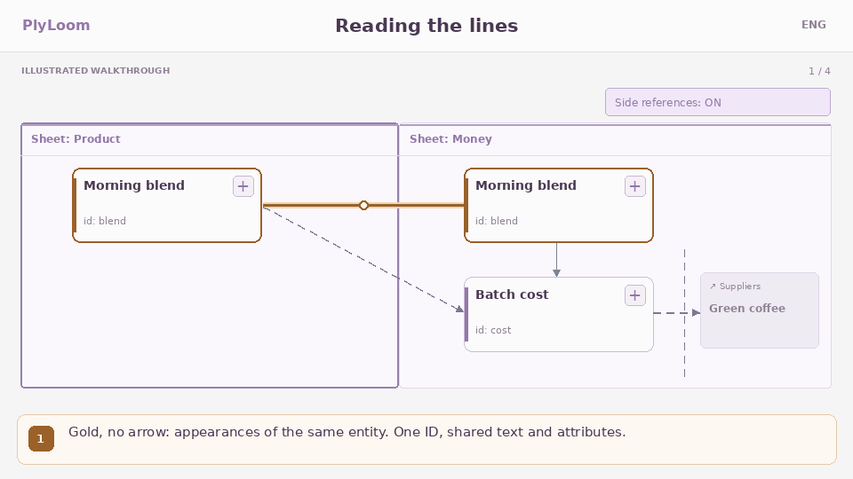

# PlyLoom

**Knowledge maps where one thing can be in several places at once — without becoming several things.**

**English** · [Русский](README.ru.md)

**0.8.0** · [Live demo](https://elpiti-matt.github.io/PlyLoom/) · [Documentation](docs/README.md) · [Project format](docs/FORMAT.md) · [Changelog](CHANGELOG.md)

[](https://github.com/Elpiti-Matt/PlyLoom/releases)

One self-contained HTML file. No install, no account, no server, no network calls.

The hosted GitHub Pages demo uses Yandex Metrica for page-view statistics with session recording disabled. The downloadable `demo/index.html` has no analytics. [Hosting and analytics](docs/PUBLISHING.ru.md#статистика-посещений-pages).

## The idea

Most mapping tools make you pick a parent. A requirement belongs to a feature, *or* to a release, *or* to a test plan — choose one, and the other two views get a copy that immediately starts drifting out of date.

PlyLoom refuses the choice. An **entity** has one ID, one name, one body of text and one set of typed attributes. It **appears** on as many **sheets** as it needs to, and each appearance carries its own position, size and shape.

- Edit the text on one sheet and it changes on all of them, because there is only one of it.
- Drag it on one sheet and nothing moves anywhere else, because geometry belongs to the appearance.
- A gold line tells you this node is also somewhere else, so you can follow it there.

Christopher Alexander argued in [*A City is Not a Tree*](https://www.patternlanguage.com/archive/cityisnotatree.html) (1965) that a living city is a semilattice — overlapping systems — rather than a tree. PlyLoom is an attempt to make notes behave that way: a sheet is a unit of *meaning*, not a folder and not a size bucket. Split a sheet when it starts answering two different questions, not when it gets big.



*Original instructional diagram, not a browser screenshot. Sheet positions and node positions are independent.*

## Try it in a minute

1. Download [`demo/index.html`](demo/index.html) and open it in any modern browser — it works from `file://`, offline, on a plane.
2. It opens with a small demo map. Click a node to expand its text and attributes.
3. Press **− All sheets** in the top right to fly up and see the whole project, then **+** on any sheet to drop back in.
4. **Project → Download .plyloom** to keep your work. That file is the portable original.

Want a bigger map to poke at? Load **Project → Other formats and examples → Example: software** — 40 nodes, 75 relations and 8 sheets of a synthetic software project, with a [three-minute walkthrough](examples/software/README.md).

## Features

### Sheets and entities

- **Sheets** — the working surface. Drag nodes, expand a card with **+** to read its text and attributes, connect nodes across sheets. There is no node limit on a sheet.
- **Shared identity** — one entity, many appearances. Name, body, type, tags and attribute values are shared by every appearance; coordinates and appearance styling are not.
- **Lay a sheet out** — turn one crowded sheet into one sheet per value of an attribute, per node tag or per node type. A node with two values lands on both new sheets, which is the point. Nodes with nothing set gather on a *No value* sheet, and Undo restores everything.
- **Project checks** — **Help → Check project** reports structural findings: sheets that stand out against the rest of *this* project, hubs, heavy memberships. They are notes to consider, not errors to fix.

### Six ways to look at the same map

| Mode | What it is for |
| --- | --- |
| **Sheet** | Normal editing of one sheet at a time |
| **Helicopter view** | Every sheet as a movable block on one canvas; drag headers, pan and zoom, open a sheet to return |
| **Spread** | 2–6 chosen sheets side by side with adjustable proportions, for comparison |
| **Stack** | All nodes of the chosen sheets as *Rows* or *Nodes & edges*, grouped by type or tag, with its own optimization |
| **Contents** | The structure of the project as a diagram or a list, with per-sheet counts |
| **All-to-1** | Each entity exactly once, fully editable, with positions saved separately from the sheets |

Inside Helicopter view, **Selected sheet only** narrows the picture to one sheet's cross-sheet relations plus direct gold links to every shared appearance — click another header to move the focus.

Switching modes never edits the project. Stack layout and camera are session state; sheet, node and All-to-1 positions are saved.

### Types, tags and attributes

- **Node types** — PlyLoom's nine base kinds plus Flowchart, Obsidian Canvas, basic BPMN and your own definitions. The notation determines the shape; no decorative glyphs.
- **Relation types** — plain text relationships such as *depends on* or *inherits from*. Meaning lives in the type and the label, not in line styling.
- **Sheet types and tags** — editable dictionaries. One type and any number of tags per sheet. No sheet type restricts what may live on it.
- **Attributes** — define once, use everywhere, in seven data types: text, number, boolean, date, URL, single choice and multiple choice. A value can be *set*, *attached but empty*, or *not attached at all* — and the filter can tell the three apart.



*Define an attribute under Types → Attributes, then attach a value to a node. The values shown are fictional.*

### Finding things again

- **Filter** — hide or dim by node type, relation type and attribute conditions: numeric and date ranges, *contains* for text and URLs, value sets for choices, plus *empty* and *no attribute*. A bar above the map shows how many nodes match and restores everything in one click.
- **Search** — word search across names, bodies, tags, sheet names and attribute values, with literal inline highlighting. The last six queries persist in this browser and can be cleared.
- **Saved views** *(new in 0.8.0)* — store a filter, a mode and the chosen sheets inside the project under a name. They travel with the `.plyloom` file, so a shared map arrives with its useful vantage points.
- **Smart sheets** *(new in 0.8.0)* — a sheet whose membership is a saved query rather than a manual list. It updates itself as you edit. Every entity keeps an ordinary home sheet, and queries only see ordinary sheets, so a smart sheet can never feed itself.

### Import and export

- **Native `.plyloom`** — the complete project: dictionaries, attributes, memberships, geometry, routes, saved views and smart queries. This is the format to keep.
- **draw.io, JSON Canvas, BPMN DI** — append sheets after a preview that lists exactly what will be simplified. Coordinates, sizes, basic shapes and route waypoints are retained; imported figures stay editable and can connect across sheets.
- **Legacy and tabular data** — older v1/v2 JSON, plus `nodes.csv` + `edges.csv` with quoted commas, newlines and BOM handled.
- **Projection exports** — draw.io and Canvas files for taking a view elsewhere. They are projections, not backups: keep the `.plyloom`.
- **Sample files** to try the importers live in [`examples/import/`](examples/import/README.md).

### Working offline, and staying that way

- **One file, no dependencies at runtime.** The released HTML embeds its own styles, fonts, illustrations and worker. Its Content-Security-Policy sets `connect-src 'none'`, so it cannot phone home even if you ask it to.
- **Autosave** to IndexedDB during idle time, with serialized transactions and migration from older browser saves. If a write fails, the last good save survives and the status says *in-memory only* instead of pretending.
- **Undo/redo** covers dictionaries, attributes, imports and geometry.
- Browser storage belongs to the browser and the origin. Moving the HTML somewhere else may mean reopening your `.plyloom` — which is why the export exists.

### Large maps

Offscreen cards and relations are culled, distant cards lose detail, and dense sheets switch to Canvas at small scale. Click a node or find it with search to jump straight to a readable, editable card. Parsing large native files and optimizing layouts run in a cancellable background worker, with a live progress readout and a Cancel button. See [PERFORMANCE](docs/PERFORMANCE.ru.md) *(Russian)* for the mechanics.

### AI assistance, without an integration

Copy a PlyLoom v3 prompt and download a matching JSON example — both generated from the same application code that validates imports, so they cannot drift. Paste them into whatever assistant you already use, and open the result as a normal file. There is no API key, no account and no outbound request.



*From the built-in help. [Still image](src/assets/help/ai-en.png).*

## Reading the lines



*Illustrated walkthrough from Help. [Still image](src/assets/help/lines-en.png).*

Every view uses the same grammar: **solid** within a sheet, **dashed** between sheets, **gold** between appearances of one ID. Gold links are generated from memberships, not stored as relations — you cannot accidentally delete your own identity.

## What it deliberately does not do

Being clear about this is faster than finding out later.

- **No 1:1 fidelity with source editors.** Complex draw.io shapes, BPMN markers, pools and lanes, groups and text styling are simplified. Images, attachments and backgrounds are not loaded. BPMN requires DI geometry. There is no Miro backup importer.
- **Solid intra-sheet lines are not strict BPMN/UML notation.** Relation types and labels keep the meaning; the stroke does not.
- **No collaboration, no sync, no cloud.** One browser, one file, and whatever you use to move files around.
- **No fixed object limits, but not infinite either.** Imports over 20 MiB, or projects over 10,000 nodes / 50,000 relations / 1,000 sheets / 2,000 definitions, ask for confirmation. A 128 MiB input and decompression ceiling protects memory. Real capacity depends on the device and how dense the graph is.
- **Older readers lose 0.8.0 additions.** Saved views and smart queries are additive v3 fields; a pre-0.8.0 version displays the stored membership snapshot but drops the queries on resave. Keep the original file.

## Project format

`.plyloom` is plain UTF-8 JSON — readable, diffable and yours. [FORMAT.md](docs/FORMAT.md) documents every field, every limit and every compatibility rule, including what older versions do with newer files. Files saved as `.plyra` by versions up to 0.7.0-rc.4 open unchanged.

## Development and validation

Node 22.12+.

```bash
npm ci
npm run dev            # local dev server
npm test               # 133 model, DOM, storage and worker tests
npm run build          # typecheck, Vite build, self-contained release HTML
```

Deeper checks:

```bash
npm run test:release -- --static   # release HTML, CSP, checksum, and the actual embedded worker
npx playwright install chromium
npm run test:browser               # the same DOM tests in real Chromium
npm run test:release               # production file at 1440 and 390 px, file://, native IndexedDB
npm run test:perf                  # rendering scenarios
npm run ai:docs                    # regenerate AI prompts and examples from application code
```

The CI browser job is optional: trigger **Actions → Checks → Run workflow** with **browser** enabled, or set the repository variable `PLYLOOM_BROWSER_CHECKS=true` to run it on every push. It uploads logs and screenshots as an artifact.

Physical phones and round trips through external editors are checked by hand against [QA-MANUAL](docs/QA-MANUAL.md). The diagrams and GIFs in this README are original instructional illustrations, not browser screenshots, and are not evidence of browser QA.

## License

[MIT](LICENSE). Dependency attribution is embedded in the released HTML and in [`THIRD_PARTY_NOTICES.txt`](THIRD_PARTY_NOTICES.txt).
