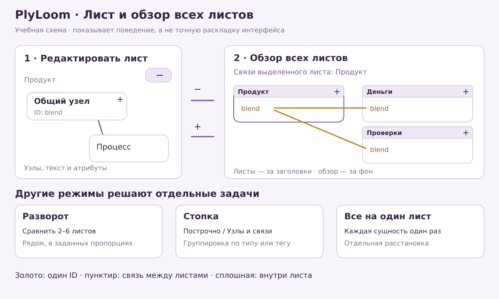
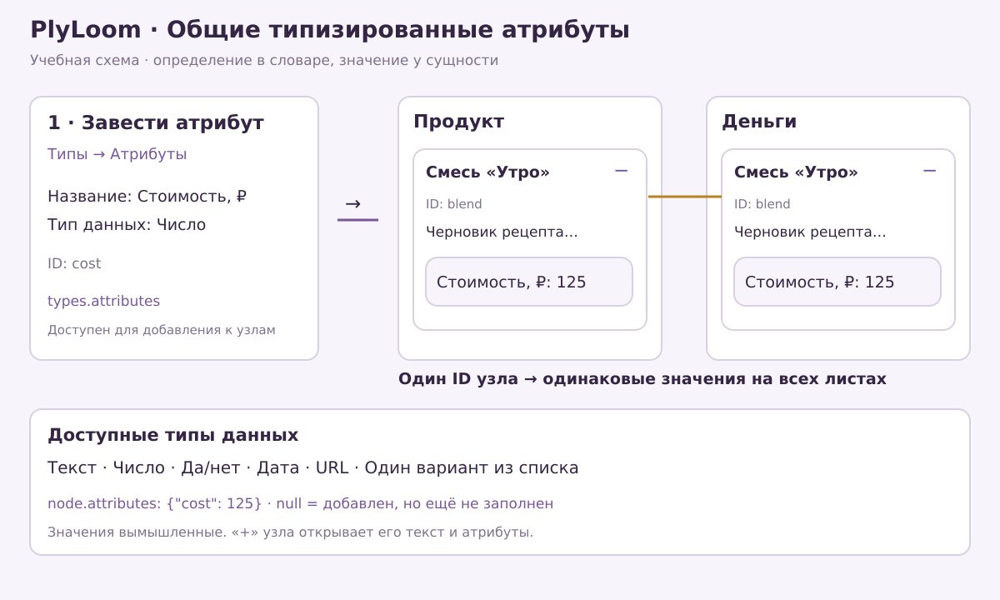
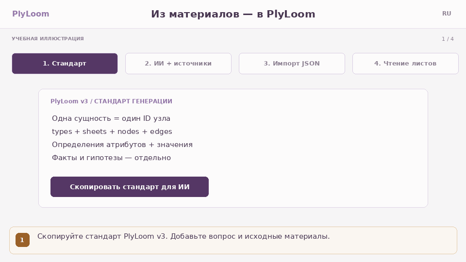
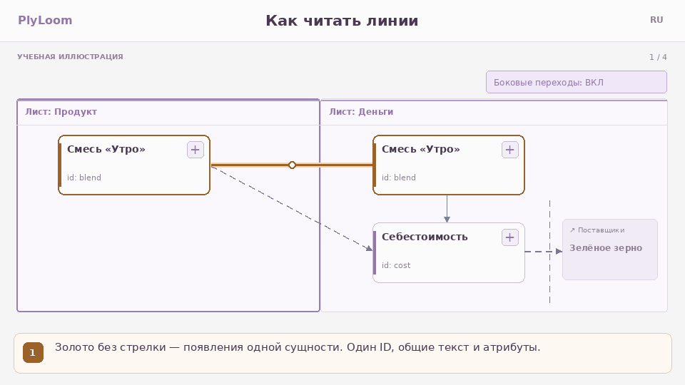

# PlyLoom

**Карта знаний, где одна вещь может быть в нескольких местах сразу — не превращаясь в несколько вещей.**

[English](README.md) · **Русский**

**0.8.0** · [Открыть демо](https://elpiti-matt.github.io/PlyLoom/) · [Возможности с картинками](docs/FEATURES.ru.md) · [Документация](docs/README.md) · [Формат](docs/FORMAT.md) · [Changelog](CHANGELOG.md)

[](https://github.com/Elpiti-Matt/PlyLoom/releases)

Один автономный HTML-файл. Без установки, без аккаунта, без сервера, без сетевых запросов.

Веб-демо на GitHub Pages использует Яндекс Метрику для статистики посещений с выключенным Вебвизором. В скачиваемом `demo/index.html` аналитики нет. [Публикация и статистика](docs/PUBLISHING.ru.md#статистика-посещений-pages).

## Идея

Большинство инструментов заставляют выбрать родителя. Требование принадлежит фиче, *или* релизу, *или* плану тестирования — выберите одно, и в двух других местах окажется копия, которая немедленно начнёт устаревать.

PlyLoom отказывается выбирать. У **сущности** один ID, одно название, один текст и один набор типизированных атрибутов. Она **появляется** на стольких **листах**, на скольких нужно, и каждое появление хранит свои координаты, размер и форму.

- Измените текст на одном листе — он изменится на всех, потому что сущность одна.
- Перетащите узел на одном листе — на других ничего не сдвинется, потому что геометрия принадлежит появлению.
- Золотая линия говорит, что этот узел есть и где-то ещё, и позволяет туда перейти.

Кристофер Александер в статье [«A City is Not a Tree»](https://www.patternlanguage.com/archive/cityisnotatree.html) (1965) доказывал, что живой город — полурешётка из пересекающихся систем, а не дерево. PlyLoom — попытка дать заметкам вести себя так же: лист это единица *смысла*, а не папка и не корзина определённого размера. Делить лист стоит тогда, когда он начинает отвечать на два разных вопроса, а не когда он стал большим.



*Учебная схема режимов, не снимок интерфейса. Положения листов и узлов независимы.*

## Попробовать за минуту

1. Скачайте [`demo/index.html`](demo/index.html) и откройте в любом современном браузере — работает из `file://`, офлайн, в самолёте.
2. Откроется небольшая демонстрационная карта. Нажмите узел, чтобы раскрыть его текст и атрибуты.
3. Нажмите **«− Все листы»** справа сверху, чтобы подняться над проектом, и **«+»** на любом листе, чтобы вернуться в редактор.
4. **Проект → Скачать .plyloom** сохранит работу. Этот файл и есть переносимый оригинал.

Нужна карта побольше? Загрузите **Проект → Другие форматы и примеры → Пример: разработка** — 40 узлов, 75 связей и 8 листов синтетического проекта разработки с [разбором на три минуты](examples/software/README.ru.md).

## Возможности

### Листы и сущности

- **Листы** — рабочая поверхность. Двигайте узлы, раскрывайте карточку кнопкой **«+»**, чтобы прочитать текст и атрибуты, связывайте узлы между листами. Лимита узлов на листе нет.
- **Общая личность** — одна сущность, много появлений. Название, текст, тип, теги и значения атрибутов общие у всех появлений; координаты и оформление — нет.
- **Разложить лист** — превратить один переполненный лист в набор листов: по одному на каждое значение атрибута, тега или типа узла. Узел с двумя значениями попадёт на оба новых листа, в этом и смысл. Узлы без значения соберутся на листе «Без значения», «Отменить» возвращает прежнюю карту.
- **Проверка проекта** — **«Справка → Проверить проект»** показывает замечания к структуре: листы, выделяющиеся на фоне остальных листов *этого* проекта, хабы, тяжёлые членства. Это заметки для размышления, а не ошибки к исправлению.

### Шесть способов посмотреть на одну карту

| Режим | Для чего |
| --- | --- |
| **Листы** | Обычное редактирование одного листа |
| **Обзор листов** | Каждый лист — подвижный блок на одном холсте; двигайте заголовки, масштабируйте, открывайте лист обратно |
| **Разворот** | 2–6 выбранных листов рядом с настраиваемыми пропорциями, для сравнения |
| **Стопка** | Все узлы выбранных листов как «Построчно» или «Узлы и связи», с группировкой по типу или тегу и отдельной оптимизацией |
| **Оглавление** | Структура проекта схемой или списком, со счётчиками по листам |
| **Все на один лист** | Каждая сущность ровно один раз, полностью редактируемая, с отдельно сохраняемыми координатами |

Внутри обзора листов переключатель **«Только для выделенного листа»** сужает картину до межлистовых связей одного листа и золотых линий ко всем его общим появлениям — нажмите другой заголовок, чтобы перенести фокус.

Переключение режимов никогда не меняет проект. Раскладка стопки и камера — настройки сеанса; координаты листов, узлов и All-to-1 сохраняются.

### Типы, теги и атрибуты

- **Типы узлов** — девять базовых видов PlyLoom плюс Flowchart, Obsidian Canvas, базовый BPMN и ваши собственные определения. Форма отражает нотацию, декоративных значков нет.
- **Типы связей** — текстовые отношения: «зависит от», «наследует от» и любые ваши. Смысл живёт в типе и подписи, а не в начертании линии.
- **Типы и теги листов** — редактируемые словари. У листа один тип и сколько угодно тегов. Тип листа ничего не запрещает размещать на нём.
- **Атрибуты** — определите один раз, используйте везде, в семи типах данных: текст, число, да/нет, дата, URL, выбор одного варианта и множественный выбор. Значение может быть *заполнено*, *привязано, но пусто* или *не привязано вовсе* — и фильтр различает все три состояния.



*Учебная схема. Сначала определение в «Типы → Атрибуты», затем значение у узла. Значения вымышленные.*

### Как найти это снова

- **Фильтр** — скрывать или приглушать по типам узлов, типам связей и условиям на атрибуты: диапазоны для чисел и дат, «содержит» для текста и ссылок, наборы значений для списков, плюс «не заполнено» и «нет атрибута». Строка над картой показывает, сколько узлов подходит, и одним нажатием возвращает всё.
- **Поиск** — по словам в названиях, текстах, тегах, названиях листов и значениях атрибутов, с дословной подсветкой совпадений. Последние шесть запросов сохраняются в этом браузере, историю можно очистить.
- **Сохранённые виды** *(новое в 0.8.0)* — сохранить фильтр, режим и выбранные листы прямо в проект под именем. Они путешествуют вместе с файлом `.plyloom`, так что присланная карта приходит со своими полезными точками обзора.
- **Умные листы** *(новое в 0.8.0)* — лист, состав которого задан сохранённым запросом, а не собран вручную. Он обновляется сам по мере правок. У каждой сущности остаётся обычный домашний лист, а запросы видят только обычные листы, поэтому умный лист не может питаться сам собой.

### Импорт и экспорт

- **Родной `.plyloom`** — целый проект: словари, атрибуты, членства, геометрия, маршруты, сохранённые виды и запросы умных листов. Именно этот формат стоит хранить.
- **draw.io, JSON Canvas, BPMN DI** — добавляют листы после предпросмотра, где прямо перечислено, что будет упрощено. Координаты, размеры, базовые формы и точки маршрутов сохраняются; импортированные фигуры остаются редактируемыми и связываются между листами.
- **Старые и табличные данные** — JSON версий v1/v2, а также пара `nodes.csv` + `edges.csv` с корректной обработкой кавычек, запятых, переводов строк и BOM.
- **Экспорт представлений** — файлы draw.io и Canvas, чтобы унести вид в другой редактор. Это проекции, а не резервные копии: храните `.plyloom`.
- **Пробные файлы** для импортёров лежат в [`examples/import/`](examples/import/README.md).

### Работа офлайн — и остаётся офлайн

- **Один файл, никаких зависимостей во время работы.** Готовый HTML содержит свои стили, шрифты, иллюстрации и воркер. Его Content-Security-Policy задаёт `connect-src 'none'`, так что он не может никуда обратиться, даже если попросить.
- **Автосохранение** в IndexedDB в моменты простоя, с сериализацией транзакций и переносом прежних браузерных сохранений. Если запись не удалась, последняя успешная остаётся на месте, а статус честно пишет «работа только в памяти».
- **Отмена и повтор** охватывают словари, атрибуты, импорты и геометрию.
- Хранилище принадлежит браузеру и адресу. После перемещения HTML может понадобиться заново открыть `.plyloom` — ради этого экспорт и существует.

### Большие карты

Карточки и связи за экраном отсекаются, далёкие карточки теряют детали, плотные листы на мелком масштабе переходят на Canvas. Нажмите узел или найдите его поиском, чтобы сразу попасть к читаемой и редактируемой карточке. Разбор больших родных файлов и оптимизация раскладки идут в отменяемом фоновом воркере: диалог показывает ход работы и кнопку отмены. Механика — в [PERFORMANCE](docs/PERFORMANCE.ru.md).

### Помощь ИИ без интеграции

Скопируйте промпт PlyLoom v3 и скачайте соответствующий пример JSON — оба генерируются из того же кода приложения, который проверяет импорт, поэтому разойтись не могут. Вставьте их в тот ассистент, которым вы уже пользуетесь, и откройте результат как обычный файл. Ни ключа API, ни аккаунта, ни исходящих запросов.



*Из встроенной справки. [Неподвижная картинка](src/assets/help/ai-ru.png).*

## Как читать связи



*Учебная GIF из встроенной справки, 4 шага. [Неподвижная картинка](src/assets/help/lines-ru.png).*

Во всех режимах действует одна грамматика: **сплошная** — внутри листа, **пунктир** — между листами, **золотая** — между появлениями одного ID. Золотые линии выводятся из членств, а не хранятся как связи, — свою собственную личность нельзя случайно удалить.

## Чего инструмент сознательно не делает

Сказать об этом сразу быстрее, чем выяснять потом.

- **Никакого совпадения 1:1 с исходными редакторами.** Сложные фигуры draw.io, маркеры BPMN, пулы и дорожки, группы и оформление текста упрощаются. Изображения, вложения и фоны не загружаются. BPMN требует геометрии DI. Импорта резервных копий Miro нет.
- **Сплошные линии внутри листа — не строгая нотация BPMN/UML.** Смысл держат тип связи и подпись, а не начертание.
- **Ни совместной работы, ни синхронизации, ни облака.** Один браузер, один файл и то, чем вы обычно передаёте файлы.
- **Фиксированных лимитов нет, но и бесконечности тоже.** Импорт больше 20 МиБ либо проект больше 10 000 узлов / 50 000 связей / 1 000 листов / 2 000 определений требует подтверждения. Потолок входных и распакованных данных в 128 МиБ защищает память. Реальная вместимость зависит от устройства и плотности графа.
- **Старые версии теряют добавления 0.8.0.** Сохранённые виды и запросы умных листов — дополнительные поля v3; версия до 0.8.0 покажет сохранённый снимок состава, но при пересохранении отбросит сами запросы. Храните оригинал файла.

## Формат проекта

`.plyloom` — обычный UTF-8 JSON: читаемый, сравнимый через diff и ваш. [FORMAT.md](docs/FORMAT.md) описывает каждое поле, каждый предел и каждое правило совместимости, включая поведение старых версий на новых файлах. Файлы, сохранённые как `.plyra` версиями до 0.7.0-rc.4, открываются без изменений.

## Разработка и проверка

Node 22.12+.

```bash
npm ci
npm run dev            # локальный сервер разработки
npm test               # 133 теста модели, DOM, хранения и воркера
npm run build          # типы, сборка Vite, автономный HTML релиза
```

Более глубокие проверки:

```bash
npm run test:release -- --static   # HTML релиза, CSP, контрольная сумма и настоящий встроенный воркер
npx playwright install chromium
npm run test:browser               # те же DOM-тесты в настоящем Chromium
npm run test:release               # готовый файл на 1440 и 390 px, file://, родной IndexedDB
npm run test:perf                  # сценарии отрисовки
npm run ai:docs                    # пересобрать AI-промпты и примеры из кода приложения
```

Браузерная задача в CI необязательна: запустите **Actions → Checks → Run workflow** с включённым **browser** или задайте переменную репозитория `PLYLOOM_BROWSER_CHECKS=true`, чтобы она шла на каждый push. Логи и скриншоты выгружаются артефактом.

Физические телефоны и перенос через внешние редакторы проверяются вручную по [QA-MANUAL](docs/QA-MANUAL.md). Схемы и GIF в этом README — оригинальные учебные иллюстрации, а не снимки браузера, и свидетельством браузерной проверки не являются.

## Лицензия

[MIT](LICENSE). Атрибуция зависимостей встроена в готовый HTML и в [`THIRD_PARTY_NOTICES.txt`](THIRD_PARTY_NOTICES.txt).
